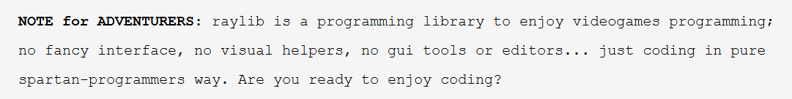

# building a multiplayer shooter like an old monk with internet access

I have a fair and decent amount of experience with gamedev, even almost about won a game jam worth 5,00,000 INR. But i realise this claim of mine to be knowing "game dev" may not be that concrete. 

My experience in "game dev" has been pretty much constricted to Unity, Godot, and a bit of bullet on android. And almost all of the games built on the same have been heavily guided by youtube tutorials / claude. Some of the projects aren't half bad, and i genuinely learnt a lot while building the same. Game development also unironically led me into the world of game reversing as well, which is a whole different thing btw, but being better at game dev gets you even better at game rev. 

However, I realise I have never actually built a game with a proper stack and architechture thought out and planned beforehand, also never built one that isn't purely offline and client side. And never built one without a tool that makes the process easier than cake. Thaat needs to change. Can't claim to be knowing game dev without some hardcore dev.

So a few rules to this :
- **no ai**
- **no yt tutorials (*no series, specific vids to an issue allowed*)**
- **no popular game engines**

***
### ok so game plan
Imma do this stuff in cpp + wasm. BECAUSE:
1. optimal type shi, plus i wanna get more familiar with cpp
2. my end goal is kinda to have an io 3d shooter typa game, (and i figured wasm should help me with hosting that ?)

now surely with JUST cpp, i probably oughta write a custom barebones game engine with an opengl renderer, that supports like 2-3 character meshes and minimal low poly graphics right. With the networking stuff coming in later ? That sounds easy right ? how hard could it be ???? \
So i set out trying to achieve the same, and guess what i found out ? **`I am a moron.`**

I grossly underestimated the complexity of writing a game engine on the web to simply just **"assist"** with the building. \
Mainly because it would take weeks of research and dev which i don't have due to exams lurking around the corner, and other better projects too.

So i decided to settle for the next best thing : [*raylib*](https://www.raylib.com/)



literally perfect for this quest. AND NO IT IS NOT A GAME ENGINE, it is a framework. (this is not copium, if you think so, ur gay)

And about the networking stuff....... i'll deal with it when it comes to it. \
A few awesome resources I found that I would watch to build a custom engine (probably will refer to these and do so in the future anyways)
[`legendary video by an alien`](https://youtu.be/qjWkNZ0SXfo?si=k3GdIK39oyHHht0G), [`course style textbook for 3d game arch + gamedev with opengl`](https://www.openvisionnetworks.com/dist/Game_Programming_in_C++_Creating_3D_Games.pdf), [`learnopengl.com`](https://learnopengl.com), [`3d graphics math primer`](https://tfetimes.com/wp-content/uploads/2015/04/F.Dunn-I.Parberry-3D-Math-Primer-for-Graphics-and-Game-Development.pdf)
### ALL RIGHT, so game plan fr :
1. setup wasm, raylib, figure out how ur cpp binary translates to working on a fucking browser
2. get a 3d camera fps working
3. get ur models in
4. make the rest of the game plan later

## Setting up wasm / emscripten / raylib

literally just followed the steps at
https://developer.mozilla.org/en-US/docs/WebAssembly/Guides/C_to_Wasm


I setup emsdk on my wsl environment. Following [this](https://emscripten.org/docs/getting_started/downloads.html#installation-instructions-using-the-emsdk-recommended)

now to test if i can get a binary compiled to wasm actually to run on the browser
```cpp
#include <iostream>
using namespace std;

int main() {
    cout << "Hello World!";
    return 0;
}

```